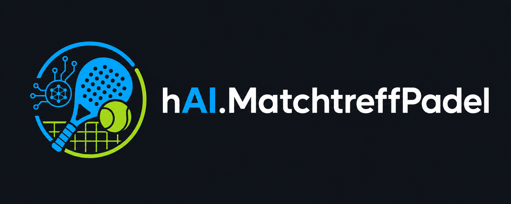

# hAI.MatchtreffPadel - Padel Matchtreff Anmeldung


[](https://github.com/jbkunama1/hAI.MatchtreffPadel)


Flask-Webapp **und Telegram-Bot** mit gemeinsamem SQLite-Backend fuer den woechentlichen Padel-Matchtreff am Donnerstag. Lizenz: MIT (siehe `LICENSE`).

## Logos & Branding

- `Logo_I_Matchtreff.png` (Root des Repos) - kleines Logo, wird im Header der Web-App angezeigt. Fuer die Flask-App muss die Datei zusaetzlich nach `static/Logo_I_Matchtreff.png` kopiert werden, da Flask statische Dateien nur aus `static/` ausliefert.
- `Logo_II_Banner.png` (Root des Repos) - grosses Banner, wird ganz oben auf der Landing-Page (`index.html`) sowie im Kopf dieser README angezeigt.

```bash
cp Logo_I_Matchtreff.png static/Logo_I_Matchtreff.png
```

## Projektueberblick

- Flask-Web-App ohne Login fuer Spieler - nur Name eintragen, fertig
- Zwei feste Donnerstag-Slots: `18:00 - 20:00` und `20:00 - 22:00`
- Admin legt maximale Teilnehmerzahl pro Slot fest
- Aenderungen und Loeschungen von Anmeldungen ausschliesslich durch den Admin
- **Telegram-Bot** zum Eintragen und als Admin-Steuerung, parallel zur Web-App
- SQLite-Backend im `instance/`-Ordner, von Web-App und Bot gemeinsam genutzt
- Docker-/Compose-Setup mit zwei Containern (Web & Bot) auf Port `1905`

## Tech-Stack

- **Backend:** Python, Flask, Gunicorn
- **Datenbank:** SQLite
- **Bot:** python-telegram-bot
- **UI:** eigenes responsives CSS im VfB-Kaessle-Design

## Slots

| Slot | Zeitraum |
|---|---|
| Slot A | 18:00 - 20:00 Uhr |
| Slot B | 20:00 - 22:00 Uhr |

Spieler koennen sich fuer einen oder beide Slots eintragen. Ist ein Slot bereits voll, ist die Auswahl fuer diesen Slot deaktiviert (Web) bzw. wird abgelehnt (Bot).

## Admin-Benutzer & Admin-Verwaltung

Beim ersten Start werden ueber Umgebungsvariablen zwei initiale Admins in der Datenbank angelegt (Passwoerter werden dabei sicher gehasht gespeichert, nicht im Klartext):

| Benutzername | Passwort-Variable |
|---|---|
| `Admin` | `ADMIN_PASSWORD_ADMIN` |
| `Daniel` | `ADMIN_PASSWORD_DANIEL` |
| `Cosme` | `ADMIN_PASSWORD_COSME` |
| `Sascha` | `ADMIN_PASSWORD_SASCHA` |
| `Patrick` | `ADMIN_PASSWORD_PATRICK` |

Der Login (`/admin/login`) erfolgt ueber ein normales Formular mit Benutzername + Passwort - keine feste Auswahlliste, da beliebig viele Admins existieren koennen.

### Weitere Admins anlegen

Jeder eingeloggte Admin - egal ob `Admin`, `Daniel` oder ein spaeter angelegter Admin - kann im Bereich **Admin-Verwaltung** (`/admin/users`) neue Admin-Accounts anlegen. Dazu werden Benutzername, Passwort (mind. 6 Zeichen) und eine Passwort-Wiederholung angegeben. Alle Admins haben identische Rechte (Slot-Limits aendern, Anmeldungen loeschen/zuruecksetzen, Design wechseln, weitere Admins anlegen/loeschen).

### Admins loeschen

Im selben Bereich lassen sich bestehende Admins wieder entfernen. Zwei Schutzmechanismen greifen dabei automatisch:

- Der **letzte verbleibende Admin** kann nicht geloescht werden, damit die App nie ohne Admin-Zugang endet.
- Ein Admin kann **sich nicht selbst loeschen** - das muss ein anderer Admin uebernehmen.

### Orga-Team hervorgehoben in der Spielerliste

Die vier Admins `Daniel`, `Cosme`, `Sascha` und `Patrick` bilden das Orga-Team und spielen selbst aktiv mit. Wenn sich einer von ihnen unter genau diesem Namen fuer einen Slot eintraegt, wird sein Name in der Spielerliste (Web-App, Admin-Dashboard und Telegram-Bot) automatisch **fett mit einem Stern (&#9733;)** hervorgehoben - so sieht jeder auf einen Blick, welcher Admin mitspielt und den Termin leitet. Die Erkennung erfolgt ueber den normalisierten Namen (Gross-/Kleinschreibung und Leerzeichen spielen keine Rolle), die Liste laesst sich im `ORGA_TEAM`-Array in `app.py` bzw. `telegram_bot.py` erweitern.

## UI-Details (wie bei VfBAHKaessle)

- **Hintergrund-Bubbles:** Wie im Original-Repo steigen dezente, animierte Blasen im Hintergrund auf (per CSS `@keyframes`, respektiert `prefers-reduced-motion`).
- **Vollstaendig responsive:** Eigene Breakpoints fuer Tablet (< 992px), Mobile (< 768px) und kleine Handys (< 480px) - Buttons werden auf dem Handy automatisch zu vollbreiten Touch-Zielen (min. 44px Hoehe), Checkboxen sind vergroessert, Schriftgroessen und Abstaende passen sich an.
- Gilt sowohl fuer die Flask-Web-App (`templates/base.html`) als auch fuer die Landing-Page (`index.html`).

## Design-Themes (wie bei PollUnit)

Der Admin kann im Admin-Dashboard zwischen mehreren vordefinierten Hintergruenden/Farbschemata waehlen, aehnlich den Themes bei PollUnit. Aktuell verfuegbar:

| Theme | Beschreibung |
|---|---|
| Standard (Blau) | Helles Blau/Grau, wie bisher |
| Sunset (Orange) | Warmer Orange-Verlauf |
| Court (Gruen) | Gruener Verlauf, passend zum Padel-Court |
| Night (Dunkel) | Dunkles Design fuer Abendmodus |

Das gewaehlte Theme wird in der Datenbank gespeichert (`settings`-Tabelle) und gilt fuer alle Besucher der Web-App, bis der Admin es aendert. Neue Themes lassen sich einfach im Dictionary `THEMES` in `app.py` ergaenzen (Label, Hintergrund-Verlauf, zwei Akzentfarben).


### Themes mit eigenen Hintergrundbildern

Zusaetzlich zu den Farbverlauf-Themes gibt es Themes, die eigene Hintergrundbilder aus dem `pictures/`-Verzeichnis nutzen (z. B. `Racketfire.png`, `Racketsplash.png`). Fuer die Web-App muessen diese Bilder zusaetzlich nach `static/backgrounds/` kopiert werden, da Flask statische Dateien nur aus `static/` ausliefert:

```bash
mkdir -p static/backgrounds
cp pictures/Racketfire.png static/backgrounds/Racketfire.png
cp pictures/Racketsplash.png static/backgrounds/Racketsplash.png
```

Weitere Bild-Themes lassen sich im `THEMES`-Dictionary in `app.py` ergaenzen, indem `background_image` auf den Dateinamen in `static/backgrounds/` gesetzt wird.

## Erklaervideo auf der Landing-Page

Die Landing-Page (`index.html`, Root des Repos) bindet das Erklaervideo `pictures/Matchtreff_Silber.mp4` direkt per HTML5-`<video>`-Tag ein. Der Pfad ist relativ zum Root, daher muss das Video im Ordner `pictures/` im Repo bleiben, damit die Landing-Page es korrekt anzeigt.

## Eintragsschutz gegen Doppel-Anmeldungen

- **Datenbank-Regel (hart):** Pro Slot ist ein normalisierter Name (getrimmt, klein geschrieben) nur einmal moeglich (`UNIQUE(slot_id, name_normalized)`), egal ueber welchen Kanal die Anmeldung erfolgt.
- **Cookie-Sperre (Web):** Nach erfolgreicher Anmeldung wird pro Slot ein Cookie im Browser gesetzt (`mtp_signed_<slot>`), das eine zweite Anmeldung ueber dasselbe Geraet fuer diesen Slot verhindert.
- **Telegram-ID-Sperre (Bot):** Im Bot verhindert die eindeutige Telegram-User-ID eine zweite Anmeldung fuer denselben Slot durch denselben Account.

## Warteliste

- Ist ein Slot voll, rutschen neue Anmeldungen automatisch auf eine **Warteliste** statt abgelehnt zu werden.
- Die Warteliste ist pro Slot auf **4 Eintraege** begrenzt (`WAITLIST_LIMIT = 4`), danach ist auch die Warteliste geschlossen.
- Loescht der Admin eine bestaetigte Anmeldung, rueckt automatisch die naechste Person von der Warteliste nach.
- Erhoeht der Admin die maximale Teilnehmerzahl eines Slots, rutschen ebenfalls automatisch so viele Wartelisten-Eintraege nach, wie neue Plaetze frei werden.

## Web-App: Features im Detail

- Anmeldung nur mit Namen - keine E-Mail-Adresse, kein Passwort, kein Account noetig
- Pro Slot eine vom Admin festgelegte maximale Teilnehmerzahl
- Live-Anzeige, wie viele Plaetze pro Slot noch frei sind
- Admin-Bereich (passwortgeschuetzt):
  - Maximale Teilnehmerzahl pro Slot aendern
  - Einzelne Anmeldungen loeschen
  - Alle Anmeldungen fuer die kommende Woche zuruecksetzen

## Telegram-Bot: Flow (Kurzfassung)

1. Bot in Telegram starten: `/start`
2. Aktuelle Slot-Belegung ansehen: `/slots`
3. Fuer einen Slot eintragen: `/eintragen <Name> <a|b|beide>`
   - Beispiel: `/eintragen MaxMustermann a`
   - Beispiel fuer beide Slots: `/eintragen MaxMustermann beide`
4. Eigenen Status abfragen: `/status <Name>`

### Admin-Befehle im Bot

Admins werden ueber die Telegram-User-ID in `ADMIN_TELEGRAM_IDS` festgelegt (kommagetrennt).

- `/admin_liste` - alle Anmeldungen fuer beide Slots anzeigen
- `/admin_max <a|b> <zahl>` - maximale Plaetze fuer einen Slot setzen
- `/admin_loeschen <id>` - einzelne Anmeldung per ID loeschen
- `/admin_reset` - alle Anmeldungen zuruecksetzen

Genau wie in der Web-App gilt: **nur Admins duerfen Anmeldungen aendern oder loeschen.**

## Lokale Installation (ohne Docker)

Voraussetzungen: Python 3.11+

```bash
git clone https://github.com/jbkunama1/hAI.MatchtreffPadel.git
cd hAI.MatchtreffPadel
python -m venv .venv
source .venv/bin/activate   # Windows: .venv\\Scripts\\activate
pip install -r requirements.txt
```

### Web-App starten

```bash
export SECRET_KEY="change-me"        # in Produktion durch sicheren Key ersetzen
export ADMIN_PASSWORD_ADMIN="change-me"    # Passwort fuer Benutzer Admin
export ADMIN_PASSWORD_DANIEL="change-me"   # Passwort fuer Benutzer Daniel
export PORT="1905"                   # Port fuer die Web-App
python app.py
```

Danach im Browser: `http://localhost:1905`

### Telegram-Bot starten

```bash
export TELEGRAM_BOT_TOKEN="dein-bot-token"
export ADMIN_TELEGRAM_IDS="123456789,987654321"
python telegram_bot.py
```

## Banner oben und groesseres Logo

Oben auf der Seite wird jetzt das Banner (`static/Logo_II_Banner.png`) angezeigt, allerdings nur auf Bildschirmen ab Tablet-Groesse (ab 768px Breite) - auf schmalen Handy-Bildschirmen wird es automatisch ausgeblendet, damit die Seite dort nicht ueberladen wirkt und die eigentlichen Anmelde-Inhalte im Vordergrund bleiben. Das kleine Logo (`Logo_I_Matchtreff.png`) neben dem Titel wurde zusaetzlich von 48px auf 64px Hoehe vergroessert.

## Umbenennung: Slot A/B zu Zeitraum FRUEH/SPAET

Die Slot-Bezeichnungen wurden von "Slot A" / "Slot B" auf "Zeitraum FRUEH" (18:00-20:00 Uhr) und "Zeitraum SPAET" (20:00-22:00 Uhr) umbenannt. Die internen Datenbank-Schluessel (`slot_a`, `slot_b`) bleiben unveraendert, sodass bestehende Anmeldungen und der Telegram-Bot (inkl. der Kurzbefehle `a`/`b`/`18`/`20`) weiterhin funktionieren - nur die sichtbaren Bezeichnungen in Web-App und Telegram-Bot wurden geaendert.

## Dark Mode als Standard + Padel-Ball-Hintergrund-Effekt

Die App startet jetzt standardmaessig im dunklen Design (Theme "Night"), statt im hellen Standard-Design. Zusaetzlich gibt es im Admin-Dashboard unter "Schwebe-Effekt im Hintergrund" einen Umschalter zwischen den bisherigen farbigen Blasen und Padel-Ball-Icons (`static/padel_ball.png`), die sich exakt gleich verhalten (gleiche Animation, Positionen, Geschwindigkeit), aber statt Kreisen dein Padel-Ball-Icon nach oben schweben und dabei leicht rotieren lassen. Beide Einstellungen (Design-Theme und Hintergrund-Effekt) werden in der Datenbank gespeichert und gelten fuer alle Besucher der Seite, bis ein Admin sie erneut aendert.

## Troubleshooting: Umgebungsvariablen aus Portainer werden ignoriert

Falls du im Portainer Stack-Editor z.B. `TELEGRAM_BOT_TOKEN` gesetzt hast, der Bot aber trotzdem mit `change-me` startet: Das liegt daran, dass in `docker-compose.yml` frueher feste Platzhalterwerte wie `TELEGRAM_BOT_TOKEN=change-me` standen, die deine echten Werte ueberschrieben haben. Das ist jetzt behoben - die Compose-Datei nutzt jetzt `${VARIABLE_NAME}`-Platzhalter, die automatisch durch die Environment-Variablen ersetzt werden, die du im Portainer Stack-Editor unter "Environment variables" einträgst.

Wichtig beim Eintragen im Stack-Editor:

- `TELEGRAM_BOT_TOKEN` = dein Bot-Token von @BotFather (Format `123456789:AAxxxxxxxxxxxxxxxxxxxxxxxxxxxxxxxxx`)
- `ADMIN_TELEGRAM_IDS` = deine numerische Telegram-User-ID (z.B. von @userinfobot), bei mehreren Admins kommagetrennt
- Alle `ADMIN_PASSWORD_*`-Variablen und `SECRET_KEY` mit echten, sicheren Werten fuellen - niemals `change-me` stehen lassen

Nach dem Setzen der Variablen den Stack in Portainer neu deployen, damit die Container mit den echten Werten neu starten.

## Troubleshooting: Gunicorn WORKER TIMEOUT

Falls im Container-Log `[CRITICAL] WORKER TIMEOUT` auftaucht, war meist ein einzelner Sync-Worker mit SQLite blockiert (z. B. durch parallele Zugriffe von Web-App und Telegram-Bot auf dieselbe Datenbankdatei). Das Projekt ist bereits entsprechend konfiguriert:

- SQLite laeuft im **WAL-Modus** (`PRAGMA journal_mode = WAL`) mit `busy_timeout`, damit parallele Lese-/Schreibzugriffe von Web-App und Bot sich nicht gegenseitig blockieren.
- Gunicorn startet mit **mehreren Workern/Threads** (`--workers 2 --threads 4 --worker-class gthread`) und einem hoeheren Timeout (`--timeout 60`), damit ein einzelner haengenger Request nicht den ganzen Prozess lahmlegt.

Falls das Problem weiterhin auftritt: pruefen, ob das `instance/`-Volume korrekt gemountet ist und ob Web-App und Bot wirklich dieselbe Datenbankdatei ueber das gemeinsame Docker-Volume `matchtreff_data` teilen.

## Deployment via Portainer (Git-basiert)

Der komplette Stack (Web-App + Telegram-Bot) laesst sich in Portainer direkt aus diesem GitHub-Repository bereitstellen - ohne manuellen Datei-Upload, inklusive automatischer Updates bei neuen Commits.

### Voraussetzungen

- Portainer CE oder EE, Zugriff auf **Stacks**
- Das Repository ist oeffentlich (oder Portainer hat Zugriff via Access Token, falls privat)
- Umgebungsvariablen bereit: `SECRET_KEY`, `ADMIN_PASSWORD`, `TELEGRAM_BOT_TOKEN`, `ADMIN_TELEGRAM_IDS`

### Schritt-fuer-Schritt-Anleitung

1. In Portainer links im Menu auf **Stacks** klicken, dann oben rechts auf **+ Add stack**.
2. Einen Namen fuer den Stack vergeben, z. B. `matchtreff-padel`.
3. Unter **Build method** die Option **Repository** auswaehlen (nicht "Web editor", nicht "Upload").
4. Folgende Felder ausfuellen:
   - **Repository URL:** `https://github.com/jbkunama1/hAI.MatchtreffPadel`
   - **Repository reference:** `refs/heads/main`
   - **Compose path:** `docker-compose.yml`
   - Falls das Repo privat ist: **Authentication** aktivieren und einen GitHub Personal Access Token hinterlegen.
5. Im Bereich **Environment variables** (oder per `.env`-Datei im Repo) folgende Variablen setzen:
   - `SECRET_KEY` = ein langer, zufaelliger String
   - `ADMIN_PASSWORD_ADMIN` = Passwort fuer den Benutzer `Admin`
   - `ADMIN_PASSWORD_DANIEL` = Passwort fuer den Benutzer `Daniel`
   - `TELEGRAM_BOT_TOKEN` = Token von @BotFather
   - `ADMIN_TELEGRAM_IDS` = Telegram-User-IDs der Admins, kommagetrennt
6. Optional, aber empfohlen: **GitOps updates** aktivieren.
   - **Mechanism:** Polling (z. B. alle 5 Minuten) oder Webhook (sofortige Aktualisierung bei Push).
   - Bei Webhook: die von Portainer angezeigte URL als Webhook im GitHub-Repo unter **Settings -> Webhooks** eintragen.
7. Unten auf **Deploy the stack** klicken.
8. Portainer klont das Repository, baut das Image ueber das vorhandene `Dockerfile` und startet die zwei Services `matchtreff_web` (Port 1905) und `matchtreff_bot` gemaess `docker-compose.yml`.

### Nach dem Deploy

- Web-App erreichbar unter `http://<server-ip>:1905`
- Admin-Login unter `http://<server-ip>:1905/admin/login` mit dem gesetzten `ADMIN_PASSWORD`
- Telegram-Bot antwortet automatisch, sobald der Container laeuft (Long Polling, kein oeffentlicher Port noetig)

### Stack aktualisieren

- **Mit GitOps-Updates (Polling oder Webhook):** einfach `git push` auf `main` - Portainer zieht die Aenderung automatisch nach und deployt neu.
- **Ohne GitOps-Updates:** im Portainer-Stack auf **Pull and redeploy** klicken, um den neuesten Commit manuell zu holen und neu zu bauen.

## Docker / Portainer (manuelles Setup ohne Git-Integration)

### Image bauen

```bash
docker build -t haimatchtreffpadel:latest .
```

### Stack mit docker-compose (Web + Bot)

```bash
docker compose up -d
# oder: docker-compose up -d
```

`docker-compose.yml` definiert zwei Services:

```yaml
services:
  matchtreff_web:
    build: .
    container_name: matchtreff_padel_web
    command: gunicorn -b 0.0.0.0:1905 app:app
    ports:
      - "1905:1905"
    environment:
      - SECRET_KEY=change-me
      - ADMIN_PASSWORD_ADMIN=change-me
      - ADMIN_PASSWORD_DANIEL=change-me
    volumes:
      - matchtreff_data:/app/instance
    restart: unless-stopped

  matchtreff_bot:
    build: .
    container_name: matchtreff_padel_bot
    command: python telegram_bot.py
    environment:
      - TELEGRAM_BOT_TOKEN=change-me
      - ADMIN_TELEGRAM_IDS=123456789
    volumes:
      - matchtreff_data:/app/instance
    restart: unless-stopped
    depends_on:
      - matchtreff_web

volumes:
  matchtreff_data:
```

- Web-App: erreichbar auf Port 1905
- Bot: laeuft im Hintergrund via Long Polling
- Beide Container teilen sich das Volume `matchtreff_data` (gleiche SQLite-Datenbank)

### Einsatz in Portainer

1. In Portainer unter **Stacks -> Add stack** gehen.
2. Inhalt der `docker-compose.yml` einfuegen.
3. `SECRET_KEY`, `ADMIN_PASSWORD`, `TELEGRAM_BOT_TOKEN` und `ADMIN_TELEGRAM_IDS` auf echte Werte setzen.
4. Stack deployen.

## Sicherheit / Betrieb

- In Produktion immer einen starken `SECRET_KEY`, ein sicheres `ADMIN_PASSWORD` und einen geheimen `TELEGRAM_BOT_TOKEN` verwenden.
- Zugriff auf die Web-App ueber einen Reverse Proxy (nginx, Traefik, Cloudflare Tunnel) absichern.
- Volume `matchtreff_data` regelmaessig sichern (Backups).
- `ADMIN_TELEGRAM_IDS` nur mit den tatsaechlichen Telegram-User-IDs der Organisatoren befuellen.

## Admin-Funktionen (Web + Telegram)

| Funktion | Web-App | Telegram-Bot |
|---|---|---|
| Slot-Belegung ansehen | Startseite | `/slots`, `/admin_liste` |
| Anmelden | Formular mit Name + Slot-Auswahl | `/eintragen <Name> <a\|b\|beide>` |
| Max. Plaetze pro Slot setzen | Admin-Dashboard | `/admin_max <a\|b> <zahl>` |
| Anmeldung loeschen | Admin-Dashboard | `/admin_loeschen <id>` |
| Alle Anmeldungen zuruecksetzen | Admin-Dashboard | `/admin_reset` |
| Duplikatsschutz | DB-Unique + Cookie pro Slot | DB-Unique + Telegram-User-ID pro Slot |
| Warteliste (max. 4 pro Slot) | Ja, mit Auto-Nachruecken | Ja, mit Auto-Nachruecken |

Spieler selbst haben in beiden Kanaelen **keine** Moeglichkeit, ihre Anmeldung zu aendern oder zu loeschen - dies liegt bewusst ausschliesslich beim Admin.
